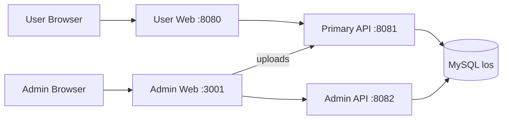

# System Overview

## Topology

## Ownership Boundaries

`apps/web` owns the public and member-facing browser experience. It communicates with `apps/api`, which owns user authentication, public content, commerce, community features, messaging, synchronization jobs, and media delivery.

`apps/admin-web` owns the operations interface. It communicates with `apps/admin-api`, which owns administrator authentication and management endpoints. The admin frontend retrieves uploaded media from the primary API because media delivery remains a primary-service responsibility.

## Development Routing

- User Web `/api` → Primary API `http://localhost:8081`
- User Web `/uploads` → Primary API `http://localhost:8081`
- Admin Web `/api` → Admin API `http://localhost:8082`
- Admin Web `/uploads` → Primary API `http://localhost:8081`

Production ingress or reverse-proxy configuration must preserve these public path contracts.

## Shared Database

Both backend services connect to the MySQL database `los`. The Primary API owns normal user workflows; the Admin API owns controlled management workflows. Because both services map shared tables independently, every schema or entity change must remain compatible with both applications and be verified against both Maven builds before release.

Database credentials are supplied through `DB_USERNAME` and `DB_PASSWORD`. JWT secrets and production credentials must be injected by the deployment environment and must not be committed to source control.
