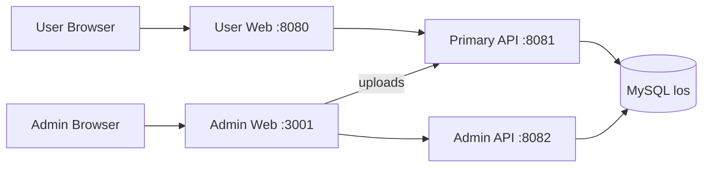

# LOS Enterprise Monorepo Structure Implementation Plan

> **For agentic workers:** REQUIRED SUB-SKILL: Use superpowers:subagent-driven-development (recommended) or superpowers:executing-plans to implement this plan task-by-task. Steps use checkbox (`- [ ]`) syntax for tracking.

**Goal:** Reorganize the existing LOS repository into a clean enterprise-style monorepo containing four independently buildable applications under `apps/` without changing application behavior.

**Architecture:** The repository root becomes an orchestration and documentation layer. The user frontend, primary API, admin frontend, and admin API live at `apps/web`, `apps/api`, `apps/admin-web`, and `apps/admin-api`; shared database bootstrap assets live under `infra/database`, while root PowerShell scripts provide consistent Windows development entry points.

**Tech Stack:** Vue 3.4, Vite 5, Pinia 2, Element Plus, Axios, Java 8, Spring Boot 2.7.18, Spring Data JPA, Spring Security/JWT, Maven, MySQL 8, PowerShell.

## Global Constraints

- Preserve all current modified and untracked source content during migration.
- Preserve ports `8080` (user web), `8081` (primary API), `3001` (admin web), and `8082` (admin API).
- Preserve all REST paths, database entities, database tables, authentication rules, and application behavior.
- Keep the two Spring Boot services independent and connected to the shared MySQL database `los`.
- Do not add Docker, Kubernetes, CI/CD, Gradle, npm workspaces, or production secrets.
- Do not commit generated `node_modules/`, `dist/`, `target/`, IDE, log, or local environment content.
- Use UTF-8 for source and documentation and consistent line-ending rules through `.gitattributes`.

---

### Task 1: Add a pre-migration inventory check

**Files:**
- Create: `scripts/Test-ProjectStructure.ps1`

**Interfaces:**
- Consumes: repository root resolved from `$PSScriptRoot`; current legacy paths and future `apps/` paths.
- Produces: process exit code `0` when exactly one valid project layout exists and all four application descriptors are present; exit code `1` with explicit missing-path messages otherwise.

- [ ] **Step 1: Write the structural check before moving files**

Create `scripts/Test-ProjectStructure.ps1` with this complete content:

```powershell
[CmdletBinding()]
param()

$ErrorActionPreference = 'Stop'
$repoRoot = Split-Path -Parent $PSScriptRoot

$legacy = @(
    'package.json',
    'src',
    'Los/pom.xml',
    'admin-web/package.json',
    'LosAdmin/pom.xml'
)

$monorepo = @(
    'apps/web/package.json',
    'apps/web/src',
    'apps/api/pom.xml',
    'apps/api/src',
    'apps/admin-web/package.json',
    'apps/admin-web/src',
    'apps/admin-api/pom.xml',
    'apps/admin-api/src'
)

function Test-PathSet {
    param([string[]]$Paths)
    return @($Paths | Where-Object {
        -not (Test-Path -LiteralPath (Join-Path $repoRoot $_))
    })
}

$legacyMissing = @(Test-PathSet -Paths $legacy)
$monorepoMissing = @(Test-PathSet -Paths $monorepo)

if ($monorepoMissing.Count -eq 0) {
    Write-Host 'PASS: enterprise monorepo structure is complete.'
    exit 0
}

if ($legacyMissing.Count -eq 0) {
    Write-Error 'FAIL: legacy project structure is still active.'
    exit 1
}

Write-Error ("FAIL: incomplete project structure. Missing: {0}" -f ($monorepoMissing -join ', '))
exit 1
```

- [ ] **Step 2: Run the check and verify the intentional failure**

Run:

```powershell
powershell -NoProfile -ExecutionPolicy Bypass -File scripts/Test-ProjectStructure.ps1
```

Expected: exit code `1` and `FAIL: legacy project structure is still active.` This proves the check distinguishes the old layout from the target layout.

- [ ] **Step 3: Commit only the check**

```powershell
git add scripts/Test-ProjectStructure.ps1
git commit -m "test: add monorepo structure check"
```

### Task 2: Move the user application into `apps/web`

**Files:**
- Move: `src/` to `apps/web/src/`
- Move: `public/` to `apps/web/public/`
- Move: `style/` to `apps/web/style/`
- Move: `index.html` to `apps/web/index.html`
- Move: `package.json` to `apps/web/package.json`
- Move: `package-lock.json` to `apps/web/package-lock.json`
- Move: `vite.config.js` to `apps/web/vite.config.js`
- Move: `jsconfig.json` to `apps/web/jsconfig.json`
- Remove: `babel.config.js`
- Remove: `vue.config.js`

**Interfaces:**
- Consumes: the current root Vue source tree and Vite package manifest.
- Produces: a standalone Vue/Vite application at `apps/web` with the existing `@` alias, `/api` proxy to port `8081`, `/uploads` proxy to port `8081`, and dev server port `8080`.

- [ ] **Step 1: Confirm obsolete Vue CLI configuration is unused**

Run:

```powershell
rg -n "babel\.config|vue\.config|@vue/cli|vue-cli-service" package.json package-lock.json src public style index.html vite.config.js jsconfig.json
```

Expected: no matches. `babel.config.js` and `vue.config.js` belong to the retired Vue CLI layout and are safe to remove from the Vite application.

- [ ] **Step 2: Create the application parent and move the user frontend**

Run these PowerShell operations from the repository root:

```powershell
New-Item -ItemType Directory -Path apps/web -Force | Out-Null
git mv src apps/web/src
git mv public apps/web/public
git mv style apps/web/style
git mv index.html apps/web/index.html
git mv package.json apps/web/package.json
git mv package-lock.json apps/web/package-lock.json
git mv vite.config.js apps/web/vite.config.js
git mv jsconfig.json apps/web/jsconfig.json
git rm babel.config.js vue.config.js
```

Expected: all user-facing source and package files are located under `apps/web`; tracked file history is represented as renames where Git can detect it. Existing untracked files nested inside the moved directories remain present at their corresponding new paths.

- [ ] **Step 3: Verify the user frontend descriptor and proxy contract**

Run:

```powershell
node -e "const p=require('./apps/web/package-lock.json'); if(p.name!=='los') process.exit(1)"
rg -n "port: 8080|localhost:8081" apps/web/vite.config.js
```

Expected: exit code `0`; Vite configuration contains port `8080` and proxy target `http://localhost:8081`.

- [ ] **Step 4: Commit the user frontend move**

```powershell
git add -A -- apps/web src public style index.html package.json package-lock.json vite.config.js jsconfig.json babel.config.js vue.config.js
git commit -m "refactor: move user frontend into apps"
```

### Task 3: Move the primary API and database bootstrap asset

**Files:**
- Move: `Los/src/` to `apps/api/src/`
- Move: `Los/pom.xml` to `apps/api/pom.xml`
- Move: `Los/init.sql` to `infra/database/init.sql`
- Exclude: `Los/target/`
- Preserve: `Los/uploads/` as `apps/api/uploads/` because it contains runtime-managed uploaded media not represented in source resources.

**Interfaces:**
- Consumes: Spring Boot service package `com.laclippers.los`, Maven descriptor, runtime uploads, and SQL bootstrap asset.
- Produces: primary API at `apps/api`, infrastructure SQL at `infra/database/init.sql`, server port `8081`, and database name `los`.

- [ ] **Step 1: Record source counts before the move**

Run:

```powershell
$apiJavaBefore = @(Get-ChildItem Los/src/main/java -Recurse -File -Filter *.java).Count
$apiResourcesBefore = @(Get-ChildItem Los/src/main/resources -Recurse -File).Count
"java=$apiJavaBefore resources=$apiResourcesBefore"
```

Expected: both counts are greater than zero. Retain the printed values for comparison in Step 3.

- [ ] **Step 2: Move source, runtime uploads, Maven descriptor, and SQL**

Run:

```powershell
New-Item -ItemType Directory -Path apps/api -Force | Out-Null
New-Item -ItemType Directory -Path infra/database -Force | Out-Null
Move-Item -LiteralPath Los/src -Destination apps/api/src
Move-Item -LiteralPath Los/uploads -Destination apps/api/uploads
Move-Item -LiteralPath Los/pom.xml -Destination apps/api/pom.xml
Move-Item -LiteralPath Los/init.sql -Destination infra/database/init.sql
```

Expected: the four source/runtime items exist at their destinations. `Los/target` may remain temporarily as an ignored generated directory and is not staged.

- [ ] **Step 3: Verify source parity and backend configuration**

Run:

```powershell
$apiJavaAfter = @(Get-ChildItem apps/api/src/main/java -Recurse -File -Filter *.java).Count
$apiResourcesAfter = @(Get-ChildItem apps/api/src/main/resources -Recurse -File).Count
"java=$apiJavaAfter resources=$apiResourcesAfter"
rg -n "port: 8081|jdbc:mysql://localhost:3306/los" apps/api/src/main/resources/application.yml
```

Expected: counts match Step 1, and both server port `8081` and database `los` appear in the configuration.

- [ ] **Step 4: Commit the primary API move**

```powershell
git add -A -- apps/api infra/database Los
git commit -m "refactor: move primary api into apps"
```

### Task 4: Move the admin applications

**Files:**
- Move: `admin-web/index.html`, `admin-web/package.json`, `admin-web/package-lock.json`, `admin-web/vite.config.js`, and `admin-web/src/` to `apps/admin-web/`
- Move: `LosAdmin/pom.xml` and `LosAdmin/src/` to `apps/admin-api/`
- Exclude: `admin-web/node_modules/`, `admin-web/dist/`, and `LosAdmin/target/`

**Interfaces:**
- Consumes: existing admin frontend and backend source trees.
- Produces: admin frontend at `apps/admin-web` using port `3001` and admin API proxy port `8082`; admin backend at `apps/admin-api` using server port `8082` and database `los`.

- [ ] **Step 1: Record admin source counts before the move**

Run:

```powershell
$adminVueBefore = @(Get-ChildItem admin-web/src -Recurse -File -Filter *.vue).Count
$adminJavaBefore = @(Get-ChildItem LosAdmin/src/main/java -Recurse -File -Filter *.java).Count
"vue=$adminVueBefore java=$adminJavaBefore"
```

Expected: both counts are greater than zero. Retain the values for Step 3.

- [ ] **Step 2: Move only source-controlled admin project content**

Run:

```powershell
New-Item -ItemType Directory -Path apps/admin-web -Force | Out-Null
New-Item -ItemType Directory -Path apps/admin-api -Force | Out-Null
Move-Item -LiteralPath admin-web/src -Destination apps/admin-web/src
Move-Item -LiteralPath admin-web/index.html -Destination apps/admin-web/index.html
Move-Item -LiteralPath admin-web/package.json -Destination apps/admin-web/package.json
Move-Item -LiteralPath admin-web/package-lock.json -Destination apps/admin-web/package-lock.json
Move-Item -LiteralPath admin-web/vite.config.js -Destination apps/admin-web/vite.config.js
Move-Item -LiteralPath LosAdmin/src -Destination apps/admin-api/src
Move-Item -LiteralPath LosAdmin/pom.xml -Destination apps/admin-api/pom.xml
```

Expected: source files and descriptors are under `apps/admin-web` and `apps/admin-api`; generated dependency/build directories remain outside the new source layout and are not staged.

- [ ] **Step 3: Verify source parity and admin port contracts**

Run:

```powershell
$adminVueAfter = @(Get-ChildItem apps/admin-web/src -Recurse -File -Filter *.vue).Count
$adminJavaAfter = @(Get-ChildItem apps/admin-api/src/main/java -Recurse -File -Filter *.java).Count
"vue=$adminVueAfter java=$adminJavaAfter"
rg -n "port: 3001|localhost:8082|localhost:8081" apps/admin-web/vite.config.js
rg -n "port: 8082|jdbc:mysql://localhost:3306/los" apps/admin-api/src/main/resources/application.yml
```

Expected: counts match Step 1; the admin frontend uses ports `3001`, `8082`, and `8081` as designed; the admin backend uses port `8082` and database `los`.

- [ ] **Step 4: Commit the admin application moves**

```powershell
git add -A -- apps/admin-web apps/admin-api admin-web LosAdmin
git commit -m "refactor: move admin applications into apps"
```

### Task 5: Establish repository-wide standards and lifecycle scripts

**Files:**
- Modify: `.gitignore`
- Create: `.editorconfig`
- Create: `.gitattributes`
- Create: `scripts/Install-Dependencies.ps1`
- Create: `scripts/Build-All.ps1`
- Create: `scripts/Start-App.ps1`

**Interfaces:**
- Consumes: the four application directories established by Tasks 2–4.
- Produces: consistent ignore/text policies and commands to install, build, or start applications from the repository root.

- [ ] **Step 1: Update `.gitignore` for nested applications**

Replace `.gitignore` with:

```gitignore
# Operating system
.DS_Store
Thumbs.db

# Editors
.idea/
.vscode/
.trae/
*.suo
*.ntvs*
*.njsproj
*.sln
*.sw?

# Frontend dependencies and output
**/node_modules/
**/dist/

# Java/Maven output
**/target/

# Local environment and secrets
**/.env
**/.env.local
**/.env.*.local

# Logs
*.log
npm-debug.log*
yarn-debug.log*
yarn-error.log*
pnpm-debug.log*

# Runtime uploads are deployment data
apps/api/uploads/
```

- [ ] **Step 2: Add editor and Git text rules**

Create `.editorconfig`:

```ini
root = true

[*]
charset = utf-8
end_of_line = lf
insert_final_newline = true
trim_trailing_whitespace = true
indent_style = space
indent_size = 2

[*.java]
indent_size = 4

[*.{yml,yaml}]
indent_size = 2

[*.md]
trim_trailing_whitespace = false
```

Create `.gitattributes`:

```gitattributes
* text=auto eol=lf
*.bat text eol=crlf
*.cmd text eol=crlf
*.ps1 text eol=crlf
*.png binary
*.jpg binary
*.jpeg binary
*.gif binary
*.mp4 binary
*.jar binary
```

- [ ] **Step 3: Add dependency installation script**

Create `scripts/Install-Dependencies.ps1`:

```powershell
[CmdletBinding()]
param()

$ErrorActionPreference = 'Stop'
$repoRoot = Split-Path -Parent $PSScriptRoot

foreach ($app in @('apps/web', 'apps/admin-web')) {
    Push-Location (Join-Path $repoRoot $app)
    try { npm ci } finally { Pop-Location }
}
```

- [ ] **Step 4: Add all-application build script**

Create `scripts/Build-All.ps1`:

```powershell
[CmdletBinding()]
param()

$ErrorActionPreference = 'Stop'
$repoRoot = Split-Path -Parent $PSScriptRoot

foreach ($app in @('apps/web', 'apps/admin-web')) {
    Push-Location (Join-Path $repoRoot $app)
    try { npm run build } finally { Pop-Location }
}

foreach ($app in @('apps/api', 'apps/admin-api')) {
    Push-Location (Join-Path $repoRoot $app)
    try { mvn test } finally { Pop-Location }
}
```

- [ ] **Step 5: Add a typed application launcher**

Create `scripts/Start-App.ps1`:

```powershell
[CmdletBinding()]
param(
    [Parameter(Mandatory)]
    [ValidateSet('web', 'api', 'admin-web', 'admin-api')]
    [string]$App
)

$ErrorActionPreference = 'Stop'
$repoRoot = Split-Path -Parent $PSScriptRoot
$appPath = Join-Path $repoRoot "apps/$App"

Push-Location $appPath
try {
    if ($App -in @('web', 'admin-web')) {
        npm run dev
    } else {
        mvn spring-boot:run
    }
} finally {
    Pop-Location
}
```

- [ ] **Step 6: Verify ignore rules and PowerShell syntax**

Run:

```powershell
git check-ignore apps/web/node_modules/example apps/admin-web/dist/index.html apps/api/target/example.class apps/api/uploads/example.jpg
$errors = $null
Get-ChildItem scripts -Filter *.ps1 | ForEach-Object { [void][System.Management.Automation.Language.Parser]::ParseFile($_.FullName, [ref]$null, [ref]$errors); if ($errors) { throw $errors } }
```

Expected: all four sample paths are printed by `git check-ignore`; PowerShell parsing exits successfully.

- [ ] **Step 7: Commit repository standards and scripts**

```powershell
git add .gitignore .editorconfig .gitattributes scripts
git commit -m "chore: add monorepo standards and lifecycle scripts"
```

### Task 6: Add application and architecture documentation

**Files:**
- Modify: `README.md`
- Create: `apps/web/README.md`
- Create: `apps/api/README.md`
- Create: `apps/admin-web/README.md`
- Create: `apps/admin-api/README.md`
- Create: `docs/architecture/system-overview.md`

**Interfaces:**
- Consumes: final application paths, ports, proxy routes, database configuration, and root scripts.
- Produces: one canonical repository guide, four app-local guides, and a service-boundary reference.

- [ ] **Step 1: Rewrite the root README as the canonical entry point**

Document all of the following exact sections in `README.md`:

```markdown
# LOS — LA Clippers Fan Platform

## Applications

| Application | Path | Port | Responsibility |
| --- | --- | --- | --- |
| User web | `apps/web` | 8080 | Public site and member experience |
| Primary API | `apps/api` | 8081 | User-facing REST API and media |
| Admin web | `apps/admin-web` | 3001 | Operations dashboard |
| Admin API | `apps/admin-api` | 8082 | Administration REST API |

## Prerequisites

- Node.js 18 or newer
- npm 9 or newer
- Java 8
- Maven 3.9
- MySQL 8

## Local Development

Set `DB_USERNAME` and `DB_PASSWORD`, run `scripts/Install-Dependencies.ps1`, then start each required application with `scripts/Start-App.ps1 -App <name>`.

## Build and Verification

Run `scripts/Build-All.ps1` and `scripts/Test-ProjectStructure.ps1` from PowerShell.

## Documentation

- `docs/architecture/system-overview.md`
- `docs/superpowers/specs/2026-10-05-enterprise-monorepo-structure-design.md`
```

Expand the local-development section with executable PowerShell examples for environment variables and all four `Start-App.ps1` values. State that production JWT secrets must not use repository defaults.

- [ ] **Step 2: Add focused application READMEs**

Each application README must include these five headings with application-specific values:

```markdown
# Application name

## Responsibility
## Prerequisites
## Configuration
## Development
## Build and Test
```

Use `npm ci`, `npm run dev`, and `npm run build` for both web applications. Use `mvn spring-boot:run` and `mvn test` for both API applications. Document the precise port and upstream proxy/database dependency for each app.

- [ ] **Step 3: Add the system overview**

Create `docs/architecture/system-overview.md` with this Mermaid topology and explanatory text:



Describe ownership boundaries, `/api` proxy behavior, `/uploads` handling, shared-database implications, and the rule that schema changes must remain compatible with both backend services.

- [ ] **Step 4: Check documentation for obsolete commands**

Run:

```powershell
rg -n "cd backend|cd Los$|cd LosAdmin$|cd admin-web$|backend/target|Los/target|LosAdmin/target" README.md apps docs/architecture
```

Expected: no matches. Historical source paths are allowed only in the approved design and implementation records under `docs/superpowers`.

- [ ] **Step 5: Commit documentation**

```powershell
git add README.md apps/*/README.md docs/architecture/system-overview.md
git commit -m "docs: document monorepo applications and workflows"
```

### Task 7: Verify the complete migration and remove empty legacy shells

**Files:**
- Verify: `apps/web/`
- Verify: `apps/api/`
- Verify: `apps/admin-web/`
- Verify: `apps/admin-api/`
- Remove if empty/generated-only: `backend/`, `Los/`, `LosAdmin/`, `admin-web/`

**Interfaces:**
- Consumes: all artifacts from Tasks 1–6.
- Produces: a verified, clean monorepo with no obsolete top-level application directories.

- [ ] **Step 1: Run the structural check and verify it turns green**

Run:

```powershell
powershell -NoProfile -ExecutionPolicy Bypass -File scripts/Test-ProjectStructure.ps1
```

Expected: exit code `0` and `PASS: enterprise monorepo structure is complete.`

- [ ] **Step 2: Install and build both frontend applications**

Run:

```powershell
powershell -NoProfile -ExecutionPolicy Bypass -File scripts/Install-Dependencies.ps1
Push-Location apps/web; npm run build; Pop-Location
Push-Location apps/admin-web; npm run build; Pop-Location
```

Expected: both Vite builds exit with code `0` and create ignored `dist/` directories.

- [ ] **Step 3: Test both backend applications**

Run:

```powershell
Push-Location apps/api; mvn test; Pop-Location
Push-Location apps/admin-api; mvn test; Pop-Location
```

Expected: both Maven commands exit with code `0`; the primary API's existing tests pass, and the admin API compiles successfully even if it contains no test cases.

- [ ] **Step 4: Audit legacy shells before removal**

Run:

```powershell
@('backend', 'Los', 'LosAdmin', 'admin-web') | ForEach-Object {
    if (Test-Path $_) {
        $unexpected = @(Get-ChildItem $_ -Recurse -File | Where-Object {
            $_.FullName -notmatch '[\\/](target|node_modules|dist)[\\/]'
        })
        if ($unexpected.Count -gt 0) {
            throw "Unexpected source remains in $($_): $($unexpected.FullName -join ', ')"
        }
    }
}
```

Expected: exit code `0`. If any non-generated file is reported, move it to its intended application before proceeding; do not delete it.

- [ ] **Step 5: Remove generated legacy shells after the audit**

Run this PowerShell safety-checked cleanup. It targets only the four explicitly audited legacy directories and refuses any resolved path outside the repository:

```powershell
$repoRoot = (Resolve-Path -LiteralPath 'D:\Projects\los').Path.TrimEnd('\')
$legacyPaths = @(
    'D:\Projects\los\backend',
    'D:\Projects\los\Los',
    'D:\Projects\los\LosAdmin',
    'D:\Projects\los\admin-web'
)

foreach ($legacyPath in $legacyPaths) {
    if (-not (Test-Path -LiteralPath $legacyPath)) { continue }
    $resolved = (Resolve-Path -LiteralPath $legacyPath).Path
    if (-not $resolved.StartsWith("$repoRoot\", [System.StringComparison]::OrdinalIgnoreCase)) {
        throw "Refusing to remove path outside repository: $resolved"
    }
    Remove-Item -LiteralPath $resolved -Recurse -Force
}
```

Expected: the audited empty/generated-only legacy directories are removed. Their generated contents are recoverable from the application descriptors; migrated source remains under `apps/`.

- [ ] **Step 6: Run final repository checks**

Run:

```powershell
powershell -NoProfile -ExecutionPolicy Bypass -File scripts/Test-ProjectStructure.ps1
git diff --check
git status --short
```

Expected: structure check passes; `git diff --check` has no output; Git status contains only intentional renames, additions, existing user modifications, and existing user deletions—no `node_modules`, `dist`, or `target` files.

- [ ] **Step 7: Commit final cleanup metadata if needed**

```powershell
git add -A -- backend Los LosAdmin admin-web apps infra scripts README.md .gitignore .editorconfig .gitattributes docs/architecture
git commit -m "chore: complete enterprise monorepo migration"
```

Expected: Git creates a commit only if prior tasks left migration-related changes. Do not use `git add -A` without the listed pathspecs because unrelated user changes must not be swept into the commit.
